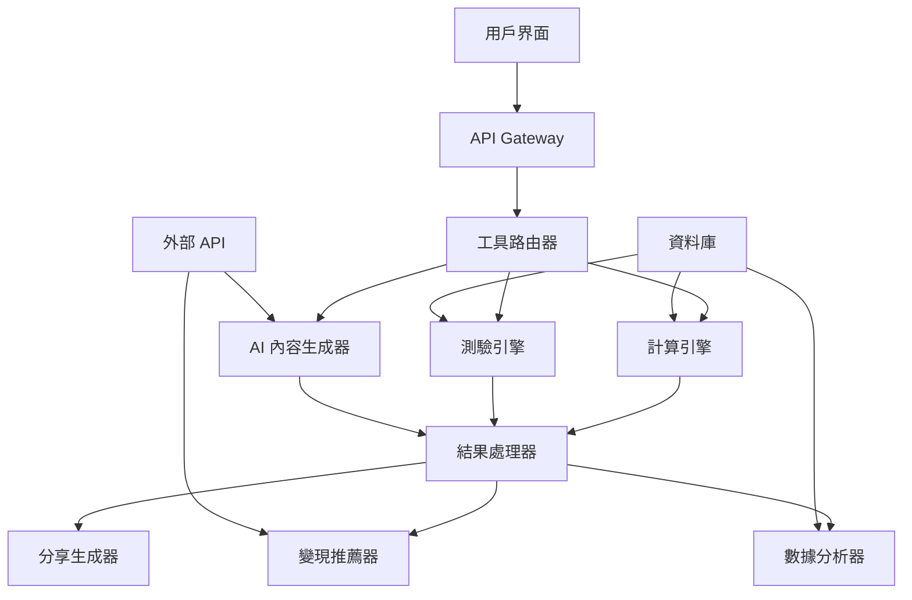

# 設計文件

## 概述

「台灣人生算式」(TW Life Formula) 是一個專為台灣人設計的生活計算平台，旨在創造病毒式傳播的娛樂體驗。平台採用模組化設計，支援快速添加新工具，並整合 AI 驅動的個性化內容生成和智能變現推薦系統。每個計算工具都融入台灣在地文化元素，提供最貼近台灣人生活的數據分析。

## 架構

### 整體架構



### 技術棧

- **前端**: 純 HTML/CSS/JavaScript (響應式設計)
- **後端**: Node.js + Express
- **資料庫**: Hostinger MySQL (現有付費方案)
- **AI 服務**: Gemini Pro API (內容生成)
- **部署**: Hostinger + GitHub Actions (現有基礎設施)
- **CDN**: Hostinger 內建 CDN

## 組件和介面

### 1. 工具管理系統

```javascript
class ToolManager {
  constructor() {
    this.tools = new Map();
    this.categories = ['calculator', 'quiz', 'simulator'];
  }

  registerTool(toolConfig) {
    // 註冊新工具的標準化介面
  }

  getToolsByCategory(category) {
    // 按類別獲取工具列表
  }

  executeToolLogic(toolId, inputData) {
    // 執行特定工具的計算邏輯
  }
}
```

### 2. 計算引擎

```javascript
class CalculatorEngine {
  // 月光族指數計算機
  calculateMoonlightIndex(salary, expenses, savings) {
    const index = ((expenses / salary) * 100);
    const ranking = this.calculateRanking(index, 'moonlight');
    return {
      index: Math.round(index),
      ranking,
      shockingFact: this.generateShockingFact(index),
      suggestions: this.generateSuggestions('financial', index)
    };
  }

  // 泡麵生存計算機
  calculateNoodleSurvival(savings, monthlyExpenses) {
    const noodleCostPerDay = 25; // 台幣
    const survivalDays = Math.floor(savings / noodleCostPerDay);
    return {
      days: survivalDays,
      months: Math.floor(survivalDays / 30),
      shockingFact: `如果失業，你可以吃泡麵活 ${survivalDays} 天`,
      comparison: this.generateComparison(survivalDays, 'survival')
    };
  }

  // 分手成本計算機
  calculateBreakupCost(relationshipMonths, monthlySpending, sharedAssets) {
    const totalSpent = relationshipMonths * monthlySpending;
    const emotionalCost = relationshipMonths * 60; // 每月60個回憶
    return {
      financialLoss: totalSpent + (sharedAssets / 2),
      emotionalLoss: emotionalCost,
      shockingFact: `分手將損失 $${totalSpent.toLocaleString()} 和 ${emotionalCost} 個回憶`,
      recoveryTime: this.calculateRecoveryTime(relationshipMonths)
    };
  }
}
```

### 3. AI 內容生成器

```javascript
class AIContenor {
  constructor(geminiApiKey) {
    this.geminiClient = new GeminiClient(apiKey);
  }

  async generatePersonalizedResult(toolType, userData, calculationResult) {
    const prompt = this.buildPrompt(toolType, userData, calculationResult);
    const response = await this.geminiClient.generateContent(prompt);
    return {
      personalizedMessage: response.personalizedMessage,
      shockingComparison: response.shockingComparison,
      viralShareText: response.viralShareText,
      improvementSuggestions: response.suggestions
    };
  }

  buildPrompt(toolType, userData, result) {
    return `
      作為一個專業的「廢物數據分析師」，請為以下結果生成震撼性且有趣的分析：
      工具類型: ${toolType}
      用戶數據: ${JSON.stringify(userData)}
      計算結果: ${JSON.stringify(result)}

      請生成：
      1. 個性化且幽默的結果描述
      2. 震撼性的比較數據
      3. 病毒式傳播的分享文案
      4. 3個「廢物但實用」的改善建議
    `;
  }
}
```

### 4. 分享生成器

```javascript
class ShareGenerator {
  async generateShareContent(toolResult, userPreferences) {
    return {
      image: await this.generateShareImage(toolResult),
      text: this.generateShareText(toolResult),
      hashtags: this.generateHashtags(toolResult.toolType),
      platforms: {
        facebook: this.optimizeForFacebook(toolResult),
        instagram: this.optimizeForInstagram(toolResult),
        line: this.optimizeForLine(toolResult)
      }
    };
  }

  async generateShareImage(result) {
    // 使用 Canvas API 生成分享圖片
    const canvas = document.createElement('canvas');
    const ctx = canvas.getContext('2d');

    // 設計震撼性的視覺呈現
    this.drawBackground(ctx);
    this.drawMainResult(ctx, result.mainValue);
    this.drawComparison(ctx, result.comparison);
    this.drawBranding(ctx);

    return canvas.toDataURL();
  }
}
```

### 5. 變現推薦器

```javascript
class MonetizationEngine {
  constructor() {
    this.affiliatePartners = new Map();
    this.loadPartnerConfigs();
  }

  generateRecommendations(toolType, userResult) {
    const recommendations = [];

    switch(toolType) {
      case 'moonlight-calculator':
        recommendations.push(
          this.getFinancialProducts(userResult.index),
          this.getBudgetingApps(),
          this.getInvestmentCourses()
        );
        break;

      case 'noodle-survival':
        recommendations.push(
          this.getInsuranceProducts(),
          this.getEmergencyFundServices(),
          this.getSavingsAccounts()
        );
        break;

      case 'breakup-cost':
        recommendations.push(
          this.getCounselingServices(),
          this.getLegalServices(),
          this.getSelfCareProducts()
        );
        break;
    }

    return this.personalizeRecommendations(recommendations, userResult);
  }
}
```

## 資料模型

### 用戶資料

```sql
CREATE TABLE users (
  id INT AUTO_INCREMENT PRIMARY KEY,
  session_id VARCHAR(255) UNIQUE,
  created_at TIMESTAMP DEFAULT CURRENT_TIMESTAMP,
  last_active TIMESTAMP DEFAULT CURRENT_TIMESTAMP ON UPDATE CURRENT_TIMESTAMP,
  preferences JSON DEFAULT '{}'
);
```

### 工具使用記錄

```sql
CREATE TABLE tool_usage (
  id INT AUTO_INCREMENT PRIMARY KEY,
  user_id INT,
  tool_type VARCHAR(100) NOT NULL,
  input_data JSON NOT NULL,
  result_data JSON NOT NULL,
  shared BOOLEAN DEFAULT FALSE,
  created_at TIMESTAMP DEFAULT CURRENT_TIMESTAMP,
  FOREIGN KEY (user_id) REFERENCES users(id)
);
```

### 分享統計

```sql
CREATE TABLE share_stats (
  id INT AUTO_INCREMENT PRIMARY KEY,
  tool_usage_id INT,
  platform VARCHAR(50) NOT NULL,
  shared_at TIMESTAMP DEFAULT CURRENT_TIMESTAMP,
  clicks INT DEFAULT 0,
  conversions INT DEFAULT 0,
  FOREIGN KEY (tool_usage_id) REFERENCES tool_usage(id)
);
```

### 工具配置

```sql
CREATE TABLE tool_configs (
  id INT AUTO_INCREMENT PRIMARY KEY,
  tool_type VARCHAR(100) UNIQUE NOT NULL,
  display_name VARCHAR(255) NOT NULL,
  description TEXT,
  category VARCHAR(50) NOT NULL,
  input_schema JSON NOT NULL,
  calculation_logic JSON NOT NULL,
  monetization_config JSON DEFAULT '{}',
  is_active BOOLEAN DEFAULT TRUE,
  created_at TIMESTAMP DEFAULT CURRENT_TIMESTAMP
);
```

### 用戶訂閱

```sql
CREATE TABLE user_subscriptions (
  id INT AUTO_INCREMENT PRIMARY KEY,
  user_id INT,
  tier VARCHAR(50) DEFAULT 'free',
  stripe_customer_id VARCHAR(255),
  stripe_subscription_id VARCHAR(255),
  status VARCHAR(50) DEFAULT 'active',
  current_period_start TIMESTAMP,
  current_period_end TIMESTAMP,
  created_at TIMESTAMP DEFAULT CURRENT_TIMESTAMP,
  updated_at TIMESTAMP DEFAULT CURRENT_TIMESTAMP ON UPDATE CURRENT_TIMESTAMP,
  FOREIGN KEY (user_id) REFERENCES users(id)
);
```

### 廣告統計

```sql
CREATE TABLE ad_stats (
  id INT AUTO_INCREMENT PRIMARY KEY,
  user_id INT,
  ad_unit_id VARCHAR(100),
  page_type VARCHAR(50),
  impressions INT DEFAULT 0,
  clicks INT DEFAULT 0,
  revenue DECIMAL(10,4) DEFAULT 0.0000,
  date DATE,
  created_at TIMESTAMP DEFAULT CURRENT_TIMESTAMP,
  FOREIGN KEY (user_id) REFERENCES users(id),
  UNIQUE KEY unique_daily_stat (user_id, ad_unit_id, date)
);
```

### 使用量限制

```sql
CREATE TABLE usage_limits (
  id INT AUTO_INCREMENT PRIMARY KEY,
  user_id INT,
  date DATE,
  tool_usage_count INT DEFAULT 0,
  daily_limit INT DEFAULT 10,
  created_at TIMESTAMP DEFAULT CURRENT_TIMESTAMP,
  FOREIGN KEY (user_id) REFERENCES users(id),
  UNIQUE KEY unique_daily_usage (user_id, date)
);
```

## 錯誤處理

### 錯誤類型定義

```javascript
class UselessToolsError extends Error {
  constructor(type, message, details = {}) {
    super(message);
    this.type = type;
    this.details = details;
    this.timestamp = new Date().toISOString();
  }
}

// 錯誤類型
const ErrorTypes = {
  CALCULATION_ERROR: 'calculation_error',
  AI_SERVICE_ERROR: 'ai_service_error',
  SHARE_GENERATION_ERROR: 'share_generation_error',
  DATABASE_ERROR: 'database_error',
  VALIDATION_ERROR: 'validation_error'
};
```

### 全域錯誤處理器

```javascript
class ErrorHandler {
  static handle(error, req, res, next) {
    console.error('Error occurred:', error);

    const response = {
      success: false,
      error: {
        type: error.type || 'unknown_error',
        message: this.getUserFriendlyMessage(error),
        timestamp: error.timestamp || new Date().toISOString()
      }
    };

    // 根據錯誤類型返回適當的狀態碼
    const statusCode = this.getStatusCode(error.type);
    res.status(statusCode).json(response);
  }

  static getUserFriendlyMessage(error) {
    const friendlyMessages = {
      'calculation_error': '計算出了點問題，請檢查輸入數據',
      'ai_service_error': 'AI 正在偷懶，請稍後再試',
      'share_generation_error': '分享功能暫時罷工，請稍後再試',
      'database_error': '資料庫在裝死，請稍後再試',
      'validation_error': '輸入的數據有點奇怪，請檢查一下'
    };

    return friendlyMessages[error.type] || '發生了一些神秘的錯誤';
  }
}
```

## 測試策略

### 單元測試

```javascript
// 計算引擎測試
describe('CalculatorEngine', () => {
  test('月光族指數計算正確性', () => {
    const engine = new CalculatorEngine();
    const result = engine.calculateMoonlightIndex(50000, 45000, 5000);

    expect(result.index).toBe(90);
    expect(result.ranking).toBeGreaterThan(0);
    expect(result.shockingFact).toContain('90%');
  });

  test('泡麵生存天數計算', () => {
    const engine = new CalculatorEngine();
    const result = engine.calculateNoodleSurvival(10000, 30000);

    expect(result.days).toBe(400);
    expect(result.months).toBe(13);
  });
});
```

### 整合測試

```javascript
describe('API Integration', () => {
  test('完整的工具使用流程', async () => {
    const response = await request(app)
      .post('/api/tools/moonlight-calculator')
      .send({
        salary: 50000,
        expenses: 45000,
        savings: 5000
      });

    expect(response.status).toBe(200);
    expect(response.body.success).toBe(true);
    expect(response.body.data.result.index).toBeDefined();
    expect(response.body.data.shareContent).toBeDefined();
  });
});
```

### 性能測試

```javascript
describe('Performance Tests', () => {
  test('計算引擎性能', async () => {
    const startTime = Date.now();

    for (let i = 0; i < 1000; i++) {
      engine.calculateMoonlightIndex(50000, 45000, 5000);
    }

    const endTime = Date.now();
    expect(endTime - startTime).toBeLessThan(1000); // 1000次計算應在1秒內完成
  });
});
```

## 部署和擴展

### Hostinger 部署配置

```yaml
# .github/workflows/deploy.yml
name: Deploy to Hostinger
on:
  push:
    branches: [main]

jobs:
  deploy:
    runs-on: ubuntu-latest
    steps:
      - uses: actions/checkout@v2
      - name: Setup Node.js
        uses: actions/setup-node@v2
        with:
          node-version: '18'
      - name: Install dependencies
        run: npm install
      - name: Build project
        run: npm run build
      - name: Deploy to Hostinger
        uses: SamKirkland/FTP-Deploy-Action@4.0.0
        with:
          server: ${{ secrets.HOSTINGER_FTP_SERVER }}
          username: ${{ secrets.HOSTINGER_FTP_USERNAME }}
          password: ${{ secrets.HOSTINGER_FTP_PASSWORD }}
          local-dir: ./dist/
```

### 環境變數配置

```bash
# .env
NODE_ENV=production
GEMINI_API_KEY=your_gemini_api_key
DB_HOST=your_hostinger_db_host
DB_USER=your_db_username
DB_PASSWORD=your_db_password
DB_NAME=useless_tools_db

# Google AdSense
ADSENSE_PUBLISHER_ID=ca-pub-xxxxxxxxxx
ADSENSE_BANNER_SLOT=xxxxxxxxxx
ADSENSE_RECTANGLE_SLOT=xxxxxxxxxx
ADSENSE_MOBILE_SLOT=xxxxxxxxxx

# Stripe 訂閱
STRIPE_PUBLISHABLE_KEY=pk_live_xxxxxxxxxx
STRIPE_SECRET_KEY=sk_live_xxxxxxxxxx
STRIPE_WEBHOOK_SECRET=whsec_xxxxxxxxxx
STRIPE_PRICE_ID=price_xxxxxxxxxx

# 訂閱設定
PREMIUM_PRICE=99
PREMIUM_CURRENCY=TWD
```

### 快取策略

```javascript
class CacheManager {
  constructor() {
    this.cache = new Map();
    this.ttl = 5 * 60 * 1000; // 5分鐘
  }

  set(key, value) {
    this.cache.set(key, {
      value,
      timestamp: Date.now()
    });
  }

  get(key) {
    const item = this.cache.get(key);
    if (!item) return null;

    if (Date.now() - item.timestamp > this.ttl) {
      this.cache.delete(key);
      return null;
    }

    return item.value;
  }
}
```

### 監控和分析

```javascript
class AnalyticsTracker {
  trackToolUsage(toolType, userId, result) {
    // 追蹤工具使用情況
    this.sendEvent('tool_used', {
      tool_type: toolType,
      user_id: userId,
      result_shocking_level: this.calculateShockingLevel(result),
      timestamp: Date.now()
    });
  }

  trackShare(toolType, platform, userId) {
    // 追蹤分享行為
    this.sendEvent('content_shared', {
      tool_type: toolType,
      platform: platform,
      user_id: userId,
      timestamp: Date.now()
    });
  }

  trackConversion(recommendationType, userId) {
    // 追蹤變現轉換
    this.sendEvent('monetization_conversion', {
      recommendation_type: recommendationType,
      user_id: userId,
      timestamp: Date.now()
    });
  }
}

### 廣告系統設計

#### Google AdSense 整合

```javascript
class AdManager {
  constructor(adSenseConfig) {
    this.config = {
      publisherId: 'ca-pub-xxxxxxxxxx',
      adUnits: {
        banner: 'xxxxxxxxxx',
        rectangle: 'xxxxxxxxxx',
        mobile: 'xxxxxxxxxx'
      }
    };
    this.loadAdSenseScript();
  }

  loadAdSenseScript() {
    const script = document.createElement('script');
    script.async = true;
    script.src = `https://pagead2.googlesyndication.com/pagead/js/adsbygoogle.js?client=${this.config.publisherId}`;
    script.crossOrigin = 'anonymous';
    document.head.appendChild(script);
  }

  createAdUnit(adType, position, containerId) {
    const adContainer = document.getElementById(containerId);
    if (!adContainer) return;

    const adElement = document.createElement('ins');
    adElement.className = 'adsbygoogle';
    adElement.style.display = 'block';
    adElement.setAttribute('data-ad-client', this.config.publisherId);
    adElement.setAttribute('data-ad-slot', this.config.adUnits[adType]);

    // 根據廣告類型設置尺寸
    switch(adType) {
      case 'banner':
        adElement.setAttribute('data-ad-format', 'horizontal');
        adElement.style.width = '100%';
        adElement.style.height = '90px';
        break;
      case 'rectangle':
        adElement.setAttribute('data-ad-format', 'rectangle');
        adElement.style.width = '300px';
        adElement.style.height = '250px';
        break;
      case 'mobile':
        adElement.setAttribute('data-ad-format', 'fluid');
        adElement.setAttribute('data-ad-layout-key', '-gw-1+2a-9x+5c');
        break;
    }

    adContainer.appendChild(adElement);
    (window.adsbygoogle = window.adsbygoogle || []).push({});
  }

  hideAllAds() {
    const ads = document.querySelectorAll('.adsbygoogle');
    ads.forEach(ad => ad.style.display = 'none');
  }
}
```

#### 用戶層級管理

```javascript
class UserTierManager {
  constructor() {
    this.tiers = {
      free: {
        name: '免費用戶',
        features: ['基本工具', '有廣告'],
        limitations: {
          dailyUsage: 10,
          showAds: true,
          shareWatermark: true
        }
      },
      premium: {
        name: '高級用戶',
        price: 99, // 台幣/月
        features: ['所有工具', '無廣告', '高級分析', '無浮水印分享'],
        limitations: {
          dailyUsage: -1, // 無限制
          showAds: false,
          shareWatermark: false
        }
      }
    };
  }

  getUserTier(userId) {
    return this.database.getUserSubscription(userId);
  }

  canUseFeature(userId, feature) {
    const userTier = this.getUserTier(userId);
    const tierConfig = this.tiers[userTier];

    switch(feature) {
      case 'advanced-tools':
        return userTier === 'premium';
      case 'no-ads':
        return !tierConfig.limitations.showAds;
      case 'unlimited-usage':
        return tierConfig.limitations.dailyUsage === -1;
      default:
        return true;
    }
  }

  getAdConfiguration(pageType, userTier) {
    if (userTier === 'premium') {
      return { showAds: false };
    }

    const adConfig = {
      showAds: true,
      positions: []
    };

    switch(pageType) {
      case 'tool-page':
        adConfig.positions = [
          { type: 'banner', position: 'top', containerId: 'ad-top' },
          { type: 'rectangle', position: 'sidebar', containerId: 'ad-sidebar' }
        ];
        break;
      case 'result-page':
        adConfig.positions = [
          { type: 'banner', position: 'bottom', containerId: 'ad-bottom' },
          { type: 'rectangle', position: 'content-middle', containerId: 'ad-middle' }
        ];
        break;
      case 'home-page':
        adConfig.positions = [
          { type: 'banner', position: 'header', containerId: 'ad-header' },
          { type: 'rectangle', position: 'tool-grid', containerId: 'ad-grid' }
        ];
        break;
    }

    return adConfig;
  }
}
```

#### 訂閱管理系統

```javascript
class SubscriptionManager {
  constructor() {
    this.stripeConfig = {
      publishableKey: 'pk_live_xxxxxxxxxx',
      priceId: 'price_xxxxxxxxxx' // 月費方案 ID
    };
  }

  async createCheckoutSession(userId) {
    const response = await fetch('/api/create-checkout-session', {
      method: 'POST',
      headers: {
        'Content-Type': 'application/json',
      },
      body: JSON.stringify({
        userId: userId,
        priceId: this.stripeConfig.priceId
      })
    });

    const session = await response.json();
    return session.url;
  }

  async handleSubscriptionSuccess(sessionId) {
    // 處理訂閱成功後的邏輯
    const response = await fetch('/api/subscription-success', {
      method: 'POST',
      headers: {
        'Content-Type': 'application/json',
      },
      body: JSON.stringify({ sessionId })
    });

    if (response.ok) {
      // 隱藏所有廣告
      window.adManager.hideAllAds();
      // 顯示成功訊息
      this.showUpgradeSuccess();
    }
  }

  showUpgradeSuccess() {
    const modal = document.createElement('div');
    modal.innerHTML = `
      <div class="upgrade-success-modal">
        <h2>🎉 升級成功！</h2>
        <p>恭喜你成為高級用戶！</p>
        <ul>
          <li>✅ 無廣告體驗</li>
          <li>✅ 無限制使用</li>
          <li>✅ 無浮水印分享</li>
          <li>✅ 高級分析功能</li>
        </ul>
        <button onclick="this.parentElement.parentElement.remove()">開始享受</button>
      </div>
    `;
    document.body.appendChild(modal);
  }
}
```
